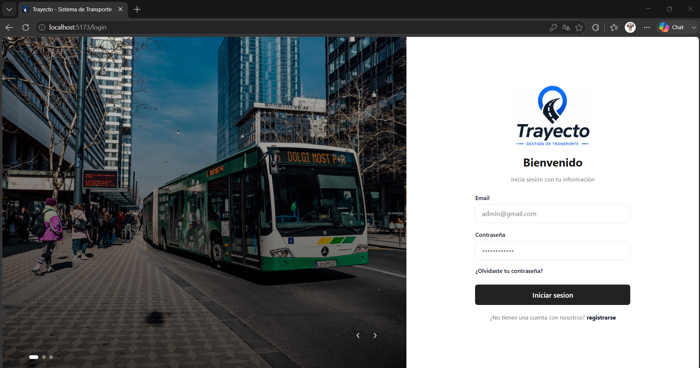
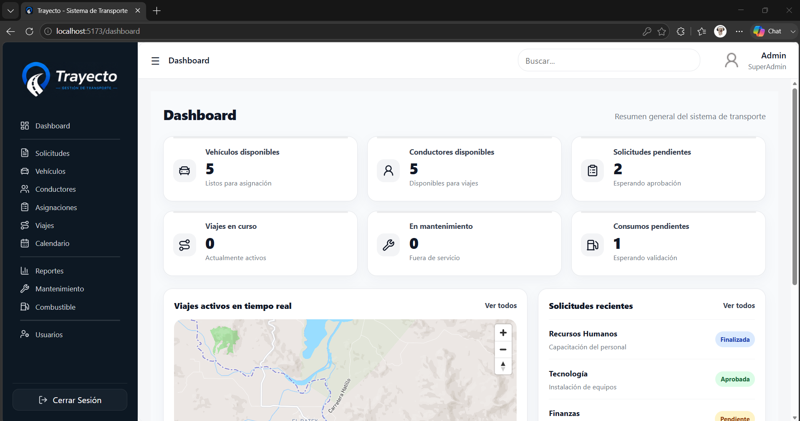
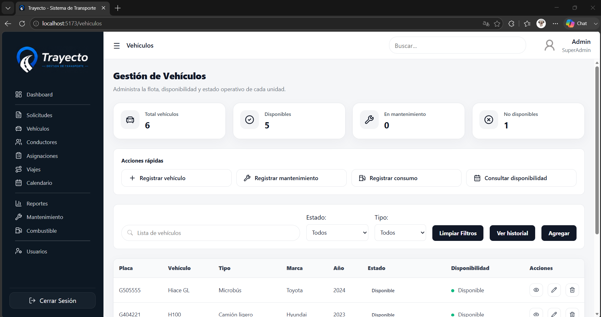
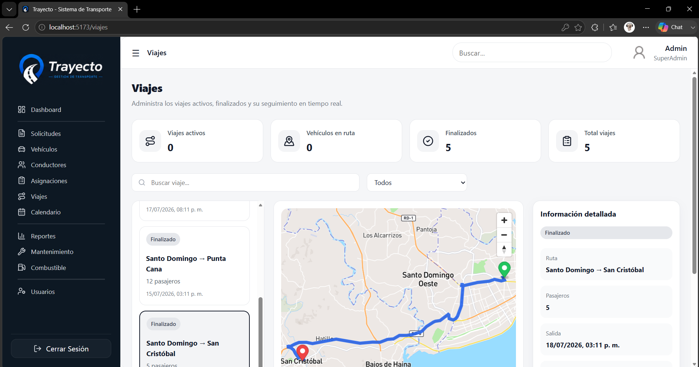
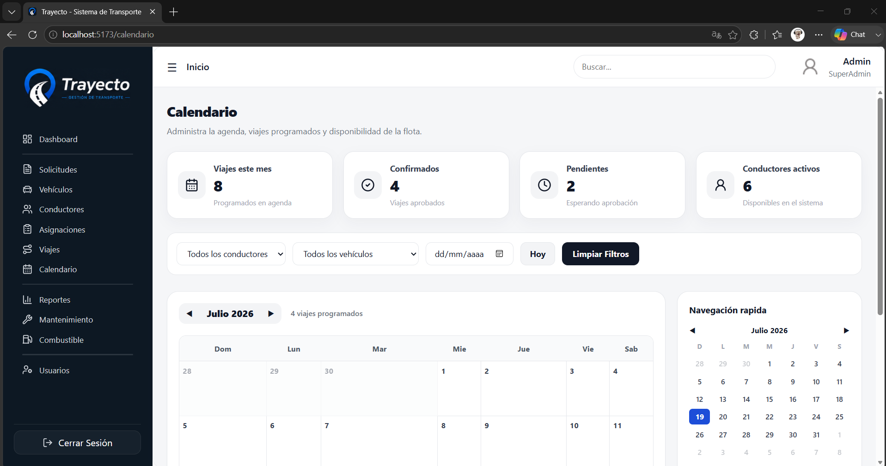

# Trayecto

<p align="center">
  
</p>

<p align="center">
  <b>Sistema Inteligente de Gestión de Transporte Empresarial</b><br>
  Plataforma desarrollada para administrar solicitudes de transporte, asignaciones, vehículos, conductores, viajes, mantenimiento y consumo de combustible en una sola aplicación.
</p>

---

# 📸 Capturas del sistema

## Inicio de sesión

<p align="center">
  
</p>

---

## Dashboard

<p align="center">
  
</p>

---

## Gestión de Vehículos

<p align="center">
  
</p>

---

## Gestión de Viajes

<p align="center">
  
</p>

---

## Calendario

<p align="center">
  
</p>

---

# ✨ Características

* Gestión completa de usuarios y roles.
* Autenticación mediante JWT.
* Administración de vehículos.
* Administración de conductores.
* Registro de solicitudes de transporte.
* Asignación de vehículos y conductores.
* Gestión de viajes.
* Calendario de viajes.
* Visualización de rutas mediante Mapbox.
* Registro de mantenimiento.
* Registro de consumo de combustible.
* Dashboard con estadísticas generales.
* Interfaz moderna y responsive.

---

# 🛠 Tecnologías utilizadas

## Backend

* ASP.NET Core 8
* Entity Framework Core
* SQL Server
* JWT Authentication
* Swagger

## Frontend

* Vue 3
* Vue Router
* Vite
* JavaScript
* CSS3
* Lucide Icons
* Mapbox GL JS

---

# 📂 Arquitectura

```text
Backend
│
├── Controllers
├── Services
├── Interfaces
├── DTOs
├── Entities
├── Data
└── Enums

Frontend
│
├── Components
├── Views
├── Router
├── Assets
└── Services
```

---

# 📊 Módulos del sistema

* Dashboard
* Usuarios
* Vehículos
* Conductores
* Solicitudes
* Asignaciones
* Viajes
* Calendario
* Mantenimiento
* Combustible
* Reportes

---

# 🔐 Roles del sistema

| Rol           | Permisos                           |
| ------------- | ---------------------------------- |
| SuperAdmin    | Acceso completo al sistema         |
| Administrador | Gestión operativa y administrativa |
| Operador      | Gestión de viajes y solicitudes    |

---

# 🚀 Instalación

## Clonar el proyecto

```bash
git clone https://github.com/tuusuario/trayecto.git
```

## Backend

```bash
cd backend

dotnet restore

dotnet ef database update

dotnet run
```

## Frontend

```bash
cd frontend

npm install

npm run dev
```

---

# Variables de entorno

Frontend

```env
VITE_MAPBOX_TOKEN=TU_TOKEN
```

Backend

```json
ConnectionStrings
```

Configurar la conexión a SQL Server en:

```text
appsettings.json
```

---

# 🗄 Base de datos

El proyecto utiliza SQL Server.

Las tablas principales son:

* Usuarios
* Roles
* Vehículos
* Conductores
* SolicitudesTransporte
* Asignaciones
* Viajes
* Mantenimientos
* ConsumosCombustible

---

# 📌 Funcionalidades destacadas

* Inicio de sesión seguro con JWT.
* Control de acceso por roles.
* Visualización de rutas mediante Mapbox.
* Agenda de viajes.
* Estadísticas en tiempo real.
* Gestión integral del transporte empresarial.

---

# 📈 Mejoras futuras

* Seguimiento GPS en tiempo real.
* Notificaciones automáticas.
* Gestión documental.
* Aplicación móvil.
* Integración con Google Calendar.
* Dashboard avanzado con gráficos.

---

# 👨‍💻 Autor

**Oliver Taveras**

Desarrollador Backend .NET | ASP.NET Core | SQL Server | Vue.js

---

<p align="center">
Proyecto desarrollado con fines académicos y de portafolio.
</p>
